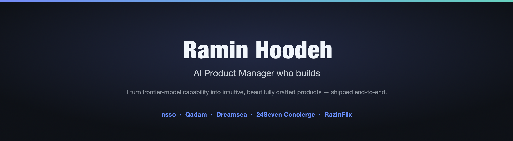

### Hi, I'm Ramin 👋 — an AI Product Manager who *builds*.

9 years in product, currently a **Product Manager at [Bayut](https://www.bayut.com/)** (one of MENA's leading property platforms, millions of users). I turn frontier-model capability into **intuitive, beautifully crafted products** — and open-source the platform underneath them. Experimentation and AI safety built in.

---

## 🚀 Things I've built

Designed, built and shipped end-to-end with my **[AI-Native Product OS](https://raminvision.notion.site/product-os)**.

| Product | What it is | |
|---|---|---|
| **nsso** | *The CV of the future* — your whole digital identity on one beautiful page | [live](https://www.nsso.me/) · [code](https://github.com/raminhoodeh/nsso) |
| **Qadam** | *A hedge-fund team that fits inside your laptop* | [live](https://www.qadam.trade/) · [code](https://github.com/raminhoodeh/qadam) |
| **Dreamsea** | *A dream interpreter under your pillow* | [App&nbsp;Store](https://apps.apple.com/us/app/dreamsea/id6761101193) |
| **24Seven Concierge** | *A holiday concierge in your pocket* | [App&nbsp;Store](https://apps.apple.com/us/app/24seven-concierge/id6663954162) · [code](https://github.com/raminhoodeh/24sevenconcierge) |
| **RazinFlix** | *From watchlist to personal Netflix* | [live](https://www.nsso.me/film/razinflix) · [code](https://github.com/raminhoodeh/razin-flix) |

**The platform powering them**

- 🧠 **[Unified RAG Pipeline](https://github.com/raminhoodeh/unified-rag-pipeline)** — one ingestion-to-retrieval layer; a source added once becomes context everywhere.
- 💸 **[AI Costs Dashboard](https://github.com/raminhoodeh/ai-costs-dashboard)** — track LLM spend and route each task to the cheapest model that still clears its eval.
- 🌀 **[Social Wisdom Agent](https://github.com/raminhoodeh/mass-social-wisdom-agent)** — bulk-transcribes social content into a shared context layer.

---

## 🛠️ How I build

I work to an **AI-Native Product OS** — a five-layer stack (**model · context · orchestration · governance · human**) run through a tight loop:

> **Talk → Decide → Build → Observe → Iterate.**

Riskiest assumption first. Human-in-the-loop where the stakes are high. Evals and guardrails before scale.

---

## 👤 About me

- 🧭 **9 years in product** — from B2C apps to B2B platforms; currently PM at Bayut.
- 🎓 Best-selling instructor — **[Product Innovation Process](https://www.udemy.com/course/the-fastest-way-to-become-a-product-manager)** & **[AI-Native Product OS](https://www.udemy.com/course/from-product-manager-to-ai-product-manager)**.
- 🎤 **[TEDx speaker](https://www.ted.com/talks/ramin_hoodeh_existentially_viewing_your_existential_crisis)** · ✍️ **[fiction author](https://www.amazon.co.uk/s?k=ramin+hoodeh&i=digital-text)**.
- 📜 IBM AI Engineering · Google Professional ML Engineer · Generative AI Leader · Anthropic Academy (MCP).

---

## 💬 Let's talk

I love building things the world really needs. Chat with **[AI Ramin](https://www.ramin.vision/)** on my portfolio — or reach me directly.

**[🌐 ramin.vision](https://www.ramin.vision/)  ·  [in LinkedIn](http://bit.ly/raminlinkedin)  ·  ✉️ raminhoodeh@gmail.com**
